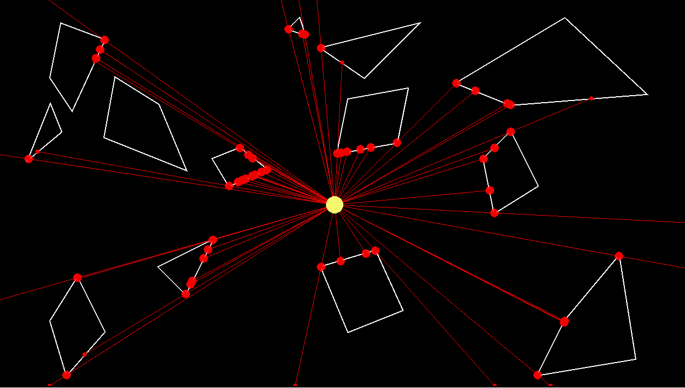
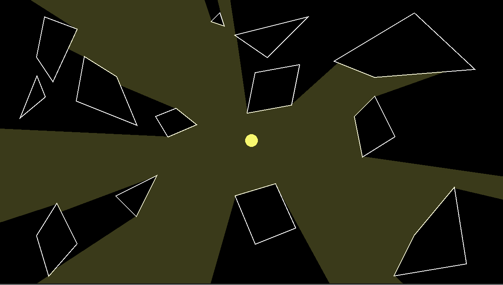

# Let There Be Light :bulb:

This project is my attempt to implement 2D lights into a custom 2D C++ game engine using SFML library.

The project takes inspiration from the article [SIGHT & LIGHT](https://ncase.me/sight-and-light/) although
it differs on how the code is structured to fit it in into the existing game engine.

Scene_Light.cpp file contains all the logic needed to implement the light effect.

In essence, we perform ray casting from the lightsource to each segment vertex and find the closest intersection point.

The light effect is achieved by using each intersection point to draw a TrianglesFan using SFML library.

